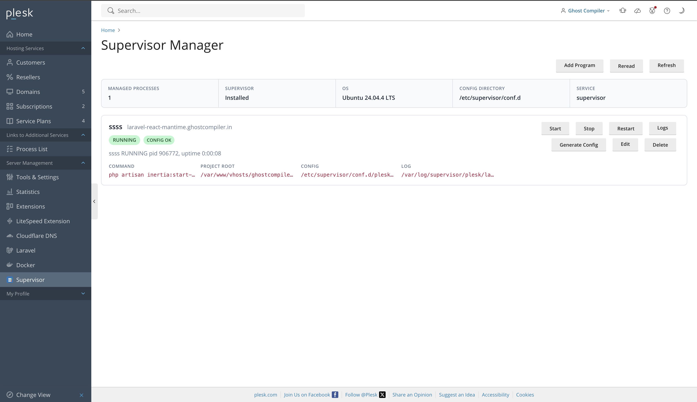
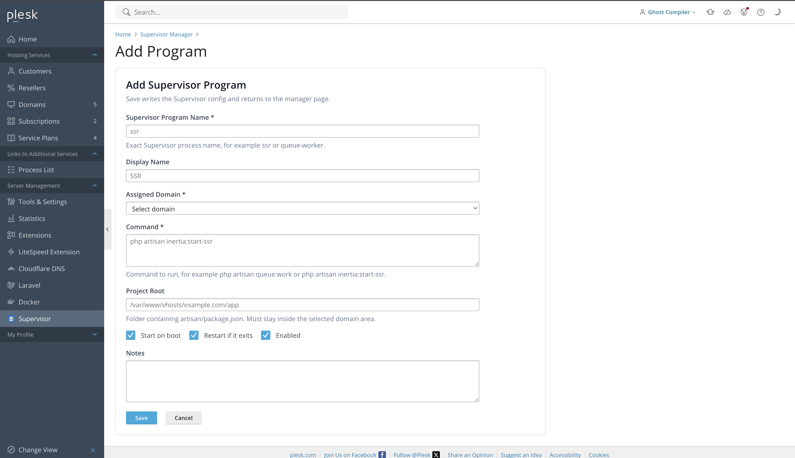
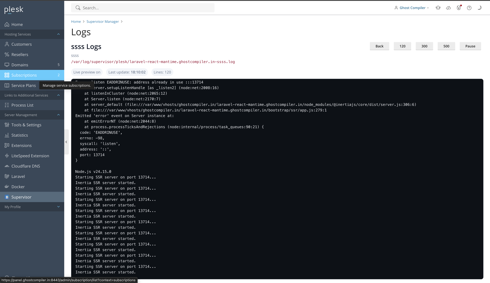

<p align="center">
  
</p>

<h1 align="center">Supervisor Manager for Plesk</h1>

<p align="center">
  Manage Supervisor processes from Plesk with admin, reseller, and customer scoped access.
</p>

<p align="center">
  
  
  
  
  
  
</p>

<p align="center">
  
  
  
</p>

---

## Overview

Supervisor Manager is a Plesk extension for creating and managing Supervisor programs directly from the Plesk interface.

It is built for hosting panels where admins need to run background commands for individual domains while keeping customers locked to their own domain scope. It can manage PHP workers, Node workers, queue consumers, schedulers, websocket servers, custom scripts, and other long-running services.

## Use Cases

- Run queue workers and background consumers.
- Run Node, PHP, Python, or shell-based worker processes.
- Manage websocket servers, schedulers, bots, daemons, and custom long-running commands.
- Let customers restart only the processes assigned to their domains.
- Give admins a single Plesk page for status, config generation, restart controls, and live logs.
- Keep Supervisor config files generated consistently under `/etc/supervisor/conf.d`.

## Screenshots


  <a href="docs/screenshots/dashboard.png">
    
  </a>
  <a href="docs/screenshots/add-program.png">
    
  </a>
  <a href="docs/screenshots/live-logs.png">
    
  </a>

<details>
<summary>Screenshot Slider</summary>

### 1. Dashboard


### 2. Add Program


### 3. Live Logs


</details>

## Features

- Admin dashboard for all managed Supervisor programs.
- Customer and reseller scoped access by assigned Plesk domain.
- Add, edit, delete, start, stop, restart, and regenerate config.
- Live log preview with pause/resume and 120/300/500 line views.
- Automatic Supervisor config generation.
- Project root locking so users cannot escape their domain area.
- Project root validation for domain-owned applications.
- Runtime PATH handling for Plesk PHP, Plesk Node.js, and system binaries.
- Generated config and log paths shown in the UI.
- One-click Supervisor install on supported Linux distributions.

## Requirements

- Plesk Onyx or Obsidian on Linux.
- PHP available to Plesk admin runtime.
- Supervisor installed, or an OS supported by the install button.
- Required runtime installed for the command you want to run, such as PHP, Node.js, Python, or another CLI binary.

Supported install detection includes:

- Ubuntu / Debian
- AlmaLinux / Rocky / RHEL / CentOS / Fedora

## Installation

Build the extension ZIP:

```sh
zip -r supervisor-manager-1.0.0.zip meta.xml DESCRIPTION.md CHANGES.md README.md htdocs plib sbin
```

Install through Plesk CLI:

```sh
plesk bin extension --install supervisor-manager-1.0.0.zip
```

Or install through Plesk UI:

1. Open **Plesk Admin**.
2. Go to **Extensions**.
3. Click **Upload Extension**.
4. Upload `supervisor-manager-1.0.0.zip`.
5. Open **Supervisor** from the Plesk sidebar.

## How It Works

When an admin saves a program, the extension:

1. Validates the selected domain.
2. Locks the project root to the selected domain area.
3. Generates a Supervisor config file.
4. Writes the config to `/etc/supervisor/conf.d`.
5. Runs `supervisorctl reread` and `supervisorctl update`.
6. Shows status, config path, log path, and live logs in Plesk.

## Adding a Program

Example queue worker:

```text
Supervisor Program Name: queue-worker
Display Name: Queue Worker
Assigned Domain: example.com
Command: php artisan queue:work --sleep=3 --tries=3
Project Root: /var/www/vhosts/example.com/app
Start on boot: enabled
Restart if it exits: enabled
Enabled: enabled
```

Example Node worker:

```text
Supervisor Program Name: realtime-worker
Display Name: Realtime Worker
Assigned Domain: example.com
Command: npm run worker
Project Root: /var/www/vhosts/example.com/realtime-app
```

Example custom script:

```text
Supervisor Program Name: importer
Display Name: Product Importer
Assigned Domain: example.com
Command: /usr/bin/python3 worker.py
Project Root: /var/www/vhosts/example.com/importer
```

Set **Project Root** to the application folder where the command should run. For Laravel commands, this is usually the folder containing `artisan`. For Node.js commands, this is usually the folder containing `package.json`.

## Generated Files

Supervisor configs:

```sh
/etc/supervisor/conf.d/plesk-*.conf
```

RHEL-style fallback path:

```sh
/etc/supervisord.d/plesk-*.conf
```

Program logs:

```sh
/var/log/supervisor/plesk/*.log
```

Extension data:

```sh
/usr/local/psa/var/modules/supervisor-manager/data/programs.json
```

Privileged helper:

```sh
/usr/local/psa/admin/sbin/modules/supervisor-manager/supervisor-manager
```

## Security Model

- Admins can create, edit, delete, and regenerate all programs.
- Customers and resellers can only see programs assigned to domains they can access.
- Project roots are locked to the selected domain area.
- Users cannot use `../` style path escapes to reach another domain.
- Server-level writes are performed through the Plesk `sbin` helper.

## Live Logs

The log page opens in a new tab and provides:

- Auto refresh every 2.5 seconds.
- Pause and resume.
- Last update timestamp.
- 120, 300, and 500 line views.
- Direct reading from `/var/log/supervisor/plesk/*.log`.

## Useful Commands

Check Supervisor:

```sh
supervisorctl status
```

Reread generated configs:

```sh
supervisorctl reread
supervisorctl update
```

Check generated files:

```sh
ls -lah /etc/supervisor/conf.d/
ls -lah /var/log/supervisor/plesk/
```

Install Supervisor on Ubuntu manually:

```sh
sudo DEBIAN_FRONTEND=noninteractive apt-get update
sudo DEBIAN_FRONTEND=noninteractive apt-get install -y supervisor
sudo systemctl enable --now supervisor
```

Check a runtime binary:

```sh
which php
which node
which python3
```

## Troubleshooting

### Config is saved but process is BACKOFF

Open **Logs**. The most common causes are:

- Wrong project root.
- Missing command runtime, such as PHP, Node.js, or Python.
- Missing application file, such as `artisan`, `package.json`, or the script passed to the command.
- Port already in use.
- Command exits immediately.

### Command cannot find an application file

Set **Project Root** to the folder where the command normally runs over SSH.

```sh
cd /var/www/vhosts/example.com/app
ls -lah
```

For example:

- Laravel commands usually run from the folder containing `artisan`.
- Node.js commands usually run from the folder containing `package.json`.
- Python or shell workers usually run from the folder containing the script file.

### Runtime command not found

Install the missing runtime or use the full binary path in the command. Examples:

```sh
which php
which node
which python3
```

### Port already in use

If the managed application binds to a port and the port is already busy, stop the duplicate process or change the application port.

### Save or delete does not show a status message

The extension returns to the manager page and shows a success or error message at the top. If the browser is still on the form page, refresh once and check the manager page again.

## Development

Validate PHP syntax:

```sh
find . -name '*.php' -o -name '*.phtml' | sort | xargs -n1 php -l
```

Package:

```sh
COPYFILE_DISABLE=1 zip -r supervisor-manager-1.0.0.zip meta.xml DESCRIPTION.md CHANGES.md README.md htdocs plib sbin
```

Install locally on Plesk:

```sh
plesk bin extension --install supervisor-manager-1.0.0.zip
```

## License

Private project. Update this section before publishing publicly.
